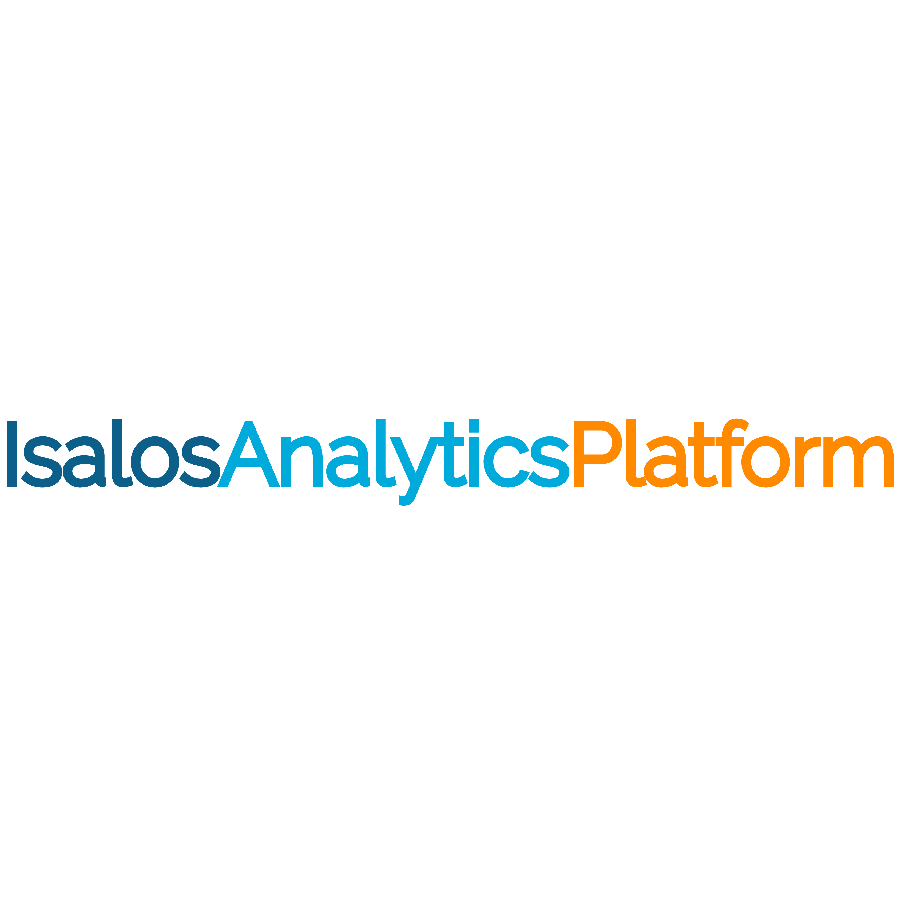

  <h1>Introduction</h1>
  
  

 
What if building powerful predictive models was as easy as working in a spreadsheet? With Isalos, it is.

Isalos is a no-code desktop analytics platform that puts the full power of machine learning, statistical analysis, and predictive modelling into the hands of everyone — no programming required. Its intuitive, spreadsheet-based interface feels instantly familiar, so you can focus on uncovering insights rather than wrestling with code.

Whether you're a researcher exploring complex datasets, a business analyst driving data-informed decisions, or a domain expert looking to build and validate models on your own terms — Isalos gives you the tools to go from raw data to actionable results in a streamlined, visual workflow.

Available on Windows, macOS, and Linux, Isalos is built to make advanced analytics truly accessible — so you can spend less time learning software and more time solving real-world problems.
 

[Click here for your 3-month free trial!](https://enaloscloud.novamechanics.com/novamechanicssystem/userregistration/){: .btn .btn-green }

## Core Concept
**Spreadsheet-Based Analytics With Zero Coding**
You already know how to use a spreadsheet. Now imagine that same familiar experience — supercharged with machine learning, predictive modelling, and advanced analytics — all without writing a single line of code.
Isalos brings the power of a full analytics engine into an interface that feels like home. Import your data just as you would in any spreadsheet application, explore it visually, apply transformations, and build sophisticated models — all through intuitive menus, buttons, and drag-and-drop interactions. If you can navigate a spreadsheet, you can do data science with Isalos.

**A Tab-Based Workflow Built for Clarity**
At the heart of Isalos is a simple yet powerful idea: **every step of your analysis lives in its own tab**.
Each tab acts as an independent processing node — you import your data, apply transformations or models, and instantly see the results, all within a clean, visual workspace. From there, outputs flow seamlessly into the next tab, letting you build sophisticated analysis pipelines step by step, without ever losing sight of your data.
Every tab follows the same intuitive structure: an **input spreadsheet** where your data lands, a **function area** where the magic happens, and an **output spreadsheet** where your results appear — ready to review, refine, or feed into the next stage.
No black boxes. No hidden steps. No coding. Just a clear, reproducible workflow from raw data to real results — powered by the spreadsheet experience you already know and trust.

---

### What can you do with Isalos?
* **Prepare your data for modelling** — follow standard pre-processing steps including normalization, filtering, variable selection, and data partitioning, all within a familiar spreadsheet-based interface.
* **Build and validate predictive models** — develop regression, classification, clustering, and anomaly detection models through an intuitive, no-code environment.
* **Automate model selection with AutoML** — let the platform test multiple algorithms and identify the best-performing model for your dataset, saving hours of manual effort.
* **Design your experiments** — plan and analyze experiments using full factorial, fractional factorial, and response surface methodologies with the built-in DOE suite.
* **Visualize and communicate insights** — create interactive charts, graphs, and dashboards to share findings with stakeholders.
 
## About Us
At NovaMechanics (NovaM), we believe powerful data analytics shouldn't require a PhD in computer science. Based in Cyprus and Greece, with over 15 years of pioneering R&D experience, we build intelligent software solutions that make advanced predictive analytics accessible to everyone — from researchers and engineers to business professionals.

Our expertise spans cheminformatics, bioinformatics, nanoinformatics, materials science, drug discovery, and computational simulations. We harness cutting-edge machine learning and mathematical techniques to turn complex data into actionable insights — helping organizations reduce risk, cut experimental costs, and accelerate innovation.

Our growing ecosystem of tools includes cloud-based services through the [Enalos Cloud Platform](https://www.enaloscloud.novamechanics.com/) and the powerful, no-code [Isalos Analytics Platform](https://isalos.novamechanics.com/) — trusted by leading universities and research institutions worldwide. From Design of Experiments and AI-powered Image Analysis to Molecular Dynamics Simulations and proprietary databases like [nanoPharos](https://pharos.novamechanics.com/nanopharos.html) and [chemPharos](https://pharos.novamechanics.com/chempharos.html), we deliver end-to-end solutions that empower smarter decisions at every stage of research and development.

We don't just analyze data — we help you shape the future of science and industry.
